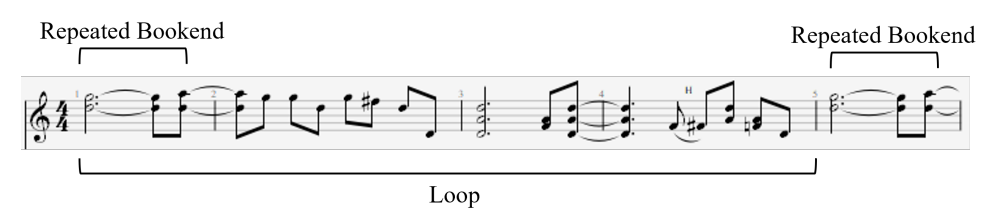

# MIDI Loop Detection

This repository contains the dataset processing code for the paper 
"The GigaMIDI Dataset with Loops and Expressive Music Performance Detection."

## Repository Layout

[**/GigaMIDI**](./GigaMIDI): Code for creating the full GigaMIDI dataset from
source files, and README with example code for loading and processing the 
data set using the `datasets` library

[**/loops_nomml**](./loops_nomml): Source files for loop detection algorithm 
and expressive performance detection algorithm

[**/scripts**](./scripts): Scripts and code notebooks for analyzing the 
GigaMIDI dataset and the loop dataset

[**/tests**](./tests): E2E tests for expressive performance detection and 
loop extractions

## Running Loop Detection

Included with GigaMIDI dataset is a collection of all loops identified in the 
dataset between 4 and 32 bars in length, with a minimum density of 0.5 notes 
per beat. For our purposes, we consider a segment of a track to be loopable if 
it is bookended by a repeated phrase of a minimum length (at least 2 beats 
and 4 note events)



### Starter Code

To run loop detection on a single MIDI file, use the `detect_loops` function
```python
from loops_nomml import detect_loops
from symusic import Score

score = Score("tests\midi_files\Mr. Blue Sky.mid")
loops = detect_loops(score)
print(loops)
```

The output will contain all the metadata needed to locate the loop within the 
file. Start and end times are represented as MIDI ticks, and density is 
given in units of notes per beat:
```
{'track_idx': [0, 1, 1, 2, 2, 3, 3, 3, 3, 3], 'instrument_type': ['Piano', 'Piano', 'Piano', 'Piano', 'Piano', 'Drums', 'Drums', 'Drums', 'Drums', 'Drums'], 'start': [238080, 1920, 97920, 15360, 216960, 7680, 195840, 278400, 284160, 117120], 'end': [241920, 3840, 99840, 17280, 220800, 9600, 207360, 289920, 291840, 130560], 'duration_beats': [9.0, 5.0, 5.0, 5.0, 9.0, 5.0, 25.0, 25.0, 17.0, 29.0], 'note_density': [0.6666666666666666, 0.8, 0.8, 0.8, 0.8888888888888888, 0.8, 2.8, 2.36, 2.2941176470588234, 2.413793103448276]}
```

### Batch Processing Loops

We also provide a script, `main.py` that batch extracts all loops in a 
dataset. This requires that you have downloaded GigaMIDI, see the [dataset README](./GigaMIDI/README.md) for instructions on doing this. Once you have the dataset downloaded, update the `DATA_PATH` and `METADATA_NAME` globals to reflect the location of GigaMIDI on your machine and run the script:

```python
python main.py
```